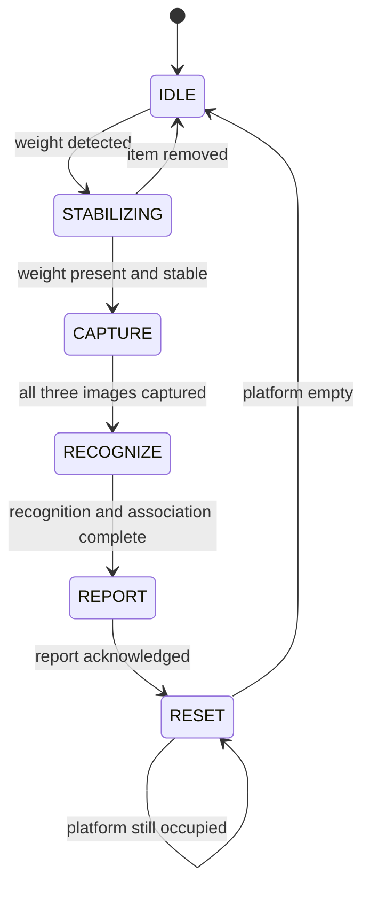
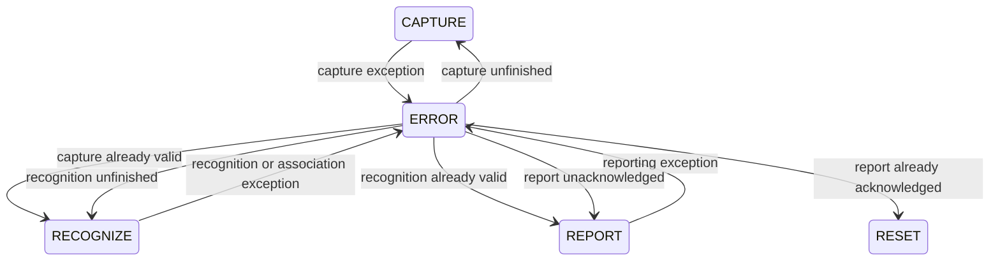

# Scan State Machine

The edge device uses a state machine to move one grocery scan through a fixed,
predictable sequence. Only one stage is active at a time. This prevents the
camera, recognition model, and reporter from running out of order.

The transition rules live in
[`edge/state_machine.py`](../edge/state_machine.py). The work performed during
each state is coordinated by
[`edge/scan_controller.py`](../edge/scan_controller.py).

## Normal Scan Flow



A normal scan proceeds as follows:

1. The machine waits in `IDLE` for the load sensor to detect an item.
2. It creates a unique `scan_id` and enters `STABILIZING`.
3. It waits until the item is present and its weight reading is stable.
4. It enters `CAPTURE` and saves one image from each of the three cameras.
5. It enters `RECOGNIZE`, detects items, and combines matching observations
   from different cameras.
6. It enters `REPORT` and sends the combined result to the receiving system.
7. After the receiver acknowledges the report, it enters `RESET`.
8. It waits for the platform to become empty, clears the completed scan data,
   and returns to `IDLE`.

The current code does not yet control platform lighting or actuators. Those
integration points are marked with `HARDWARE TODO` or `PLATFORM BLOCKED` and
tracked in [`hardware-integration-checklist.md`](hardware-integration-checklist.md).

## State Reference

| State | Purpose | Expected input or action | Leaves the state when |
| --- | --- | --- | --- |
| `IDLE` | Wait for a new item | Load sensor reports weight | Weight is detected |
| `STABILIZING` | Prevent motion from affecting the scan | Read weight presence and stability | Weight is stable, or the item is removed |
| `CAPTURE` | Save all camera views | Illuminate and capture three images | All three images are available |
| `RECOGNIZE` | Identify and consolidate items | Run recognition, then association | An association report exists |
| `REPORT` | Deliver the completed result | Send the association report | The receiver acknowledges it |
| `RESET` | Finish the physical scan cycle | Check whether the platform is empty | The item is removed |
| `ERROR` | Pause normal work after a recoverable failure | Wait for recovery confirmation | The problem is reported as recovered |

The enum values are written as three-bit binary numbers, such as `0b010` for
`CAPTURE`. Application code should compare the state names rather than rely on
their numeric order.

## Data Stored by the State Machine

The `StateMachine` deliberately stores only workflow status. Camera objects,
images, and reports belong to the `ScanController`.

| Field | Meaning |
| --- | --- |
| `state` | The currently active `State` value |
| `scan_id` | UUID connecting all images and reports from the current scan |
| `cap_valid` | Whether the camera stage completed successfully |
| `rec_valid` | Whether recognition and association completed successfully |
| `report_ack` | Whether the receiver acknowledged the report |
| `error_source` | The state that was active immediately before `ERROR` |

The three completion flags matter during recovery. They prevent completed work
from being repeated unnecessarily. For example, if capture succeeded before a
later capture-stage error was recorded, recovery can continue to `RECOGNIZE`
instead of taking another set of photographs.

After a completed scan, its ID and completion flags are cleared only when
`RESET` confirms that the platform is empty. Keeping them while the platform
is occupied prevents a second scan of the same item. An item removed earlier,
during `STABILIZING`, instead cancels that scan and clears its ID immediately.

## Error and Recovery Flow

Camera, filesystem, recognition, association, and reporting failures use the
same `ERROR` state.



Calling `handle_error()` records the current state in `error_source` before
entering `ERROR`. Calling it again while already in `ERROR` does not overwrite
the original source.

`handle_recovery(recovered=True)` returns to the first unfinished stage:

- An unfinished capture returns to `CAPTURE`.
- A valid capture continues to `RECOGNIZE`.
- Unfinished recognition returns to `RECOGNIZE`.
- Valid recognition continues to `REPORT`.
- An unacknowledged report returns to `REPORT`.
- An acknowledged report continues to `RESET`.
- Errors originating in `IDLE`, `STABILIZING`, or `RESET` return directly to
  their source state.

When `recovered` is false, or no `error_source` is available, the machine stays
in `ERROR`.

## Relationship to `ScanController`

The state machine decides **when** a transition is allowed. The controller does
the actual work:

| Controller method | State in which it is valid | Responsibility |
| --- | --- | --- |
| `process_capture()` | `CAPTURE` | Capture three images and report completeness |
| `process_recognition()` | `RECOGNIZE` | Run recognition, associate camera observations, and save the reports |
| `process_report()` | `REPORT` | Send the association report and pass back the acknowledgement |
| `process_reset()` | `RESET` | Wait for an empty platform and clear cached images and reports |
| `process_current_state()` | Any state | Dispatch one state-appropriate action per call |

Calling a `process_*` method in the wrong state raises `RuntimeError`. In
contrast, state-machine event handlers called in the wrong state are ignored.
This keeps stray or delayed sensor events from forcing an invalid transition.

`process_current_state()` performs at most one stage per call. The hardware
loop should call it repeatedly with the latest sensor readings rather than
expecting one call to complete an entire scan.

## Where to Make Changes

- Add or change transition rules in `edge/state_machine.py`.
- Add hardware or pipeline work in `edge/scan_controller.py` or the relevant
  component package.
- Add focused transition tests in `tests/test_state_machine.py`.
- Add controller behavior tests in `tests/test_scan_controller.py`.
- Add complete scan scenarios in `tests/test_scan_integration.py`.
- Record physical interface decisions in
  `documentation/hardware-integration-checklist.md`.

When adding a new state, update the `State` enum, add its event handler, teach
`ScanController.process_current_state()` how to dispatch it, and test both its
successful and failure paths. Also update the diagrams and tables in this file.

## Running the State-Machine Tests

From the repository root:

```bash
python3 -m unittest tests.test_state_machine -v
python3 -m unittest tests.test_scan_controller -v
python3 -m unittest tests.test_scan_integration -v
```
